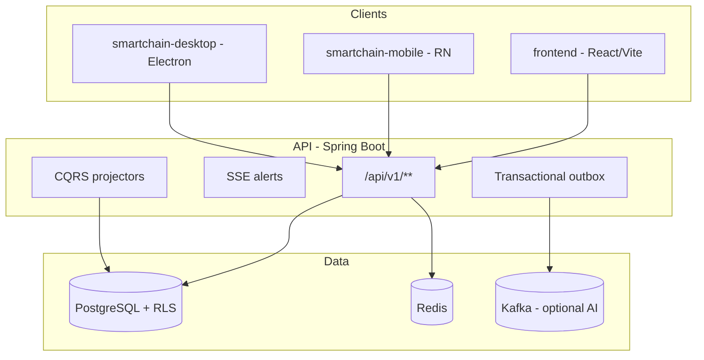

# SmartAccounting — System documentation

Enterprise multi-tenant ERP for Rwanda retail and accounting: web dashboards, mobile POS, optional desktop shell, and a Spring Boot API on PostgreSQL with tenant isolation (RLS).

**Repository layout**

| Path | Role |
|------|------|
| `src/main/java/com/smartaccounting/` | Backend API (Spring Boot 3, Java 21) |
| `src/main/resources/db/migration/` | Flyway schema (V1–V72+) |
| `frontend/` | React + Vite web dashboards |
| `smartchain-mobile/` | React Native 0.76 POS / field app |
| `smartchain-desktop/` | Electron wrapper around `frontend/` |
| `docs/` | Manual tests, go-live, integrations |
| `e2e/` | Maestro flows (`smoke.yaml`, `smoke-full.yaml`) |
| `perf/k6/` | Load smoke scripts |
| `.github/workflows/` | CI, mobile phase gate, mobile release |

**Git phase tags (mobile delivery):** `phase1-complete` … `phase6-complete`, `phase6-hardened` @ `6e1e08b`.

---

## 1. Architecture



**Cross-cutting**

- **Tenancy:** `X-Tenant-Id`, `X-User-Id` headers; JWT with tenant/user claims; PostgreSQL RLS via `app.tenant_id`.
- **Auth:** Login, refresh, logout, MFA for privileged roles, OAuth2 (Google/Microsoft), service-account API keys.
- **Reliability:** Idempotency keys on financial mutations; transactional outbox; correlation IDs in logs.
- **AI:** Copilot agent runs, forecast jobs, anomaly detection, embeddings (OpenAI) + completion (Anthropic) with dev placeholders.

---

## 2. Backend API

**Base URL:** `/api/v1` (local default `http://localhost:8080/api/v1`).

**~70 REST controllers** including:

| Domain | Controllers (prefix) |
|--------|----------------------|
| Auth | `AuthController`, `OAuth2AuthController` — `/auth` |
| Dashboards / export | `ExportController` — `/dashboards` |
| AI | `AiController`, `AiAdminController` — `/ai` |
| Anomaly | `AnomalyCaseController` — `/anomaly` |
| POS / till | `PosController`, `TillSessionController`, `ReturnsController` — `/pos`, `/till` |
| Mobile sync | `MobileSyncController`, `SyncController` — `/sync` |
| Mobile payments / receipts | `MobilePaymentController`, `MobileReceiptController`, `MobileMoneyWebhookController` |
| Procurement | `PurchaseOrderController`, `ProcurementController` — `/procurement` |
| Inventory | `InventoryController`, `StockTransferController`, `ShrinkageController` |
| Sales / customers | `SalesController`, `CustomerController`, `PromotionController`, `PriceListController` |
| Finance | `FinanceController`, `ReceivablesPayablesController`, `BankReconciliationController`, `LedgerFlowController`, `PaymentApplicationController` |
| Accounting | `AccountingOpsController`, `CloseWorkflowController` |
| HR / payroll | `HrController`, `PayrollController`, `ShiftController`, `AttendanceController` |
| Compliance (Rwanda) | `EbmController`, `ComplianceController`, `RwandaComplianceController`, `TaxController` |
| Platform | `PlatformOpsController`, `TenantDataSharingController`, `FeatureFlagController`, `WebhookController` |
| Admin | `AdminTenantController`, `AdminServiceAccountController`, … |
| Other | `DocumentController`, `AssetController`, `ReportController`, `WorkflowController`, `IotController`, `MarketplaceController` |

**Notable endpoints (recent / mobile-critical)**

| Method | Path | Purpose |
|--------|------|---------|
| POST | `/compliance/ebm/receipts/submit` | Mobile EFD submit (live if EBM configured, else mock) |
| GET | `/compliance/ebm/test` | Integration mode probe |
| POST | `/payments/momo/verify` | USSD / reference verification |
| POST | `/payments/momo/stk-push` | MTN MoMo request-to-pay (dry-run without secrets) |
| POST | `/pos/receipts/{id}/deliver` | WhatsApp or SMS receipt |
| POST | `/ai/reorder-suggestions/approve-all` | Batch draft POs from reorder AI |
| POST | `/ai/analytics/demand-forecast/create-pos` | POs from forecast gaps |
| POST | `/anomaly/alerts/reviewed`, `/escalate` | Anomaly workflow |
| GET | `/ai/copilot/agent/...` | Agent runs, approvals, SSE stream |

**Database:** 68+ Flyway migrations — core ERP, POS, MoMo recon, EBM, payroll, locations/registers (Phase 3), RRA fiscal (V72), push tokens, till sessions, etc.

**Run locally**

```powershell
docker compose up -d          # Postgres :5433, Redis
.\gradlew.bat bootRun
```

See [README.md](../README.md) for demo seed tenant `11111111-1111-4111-8111-111111111111` and role test users.

---

## 3. Web frontend (`frontend/`)

React + TypeScript + Vite.

**Features**

- Role-based routing (CEO, CFO, Sales, Ops, HR, Marketing, Accounting, …).
- KPI cards, trends, drill-down tables, CSV/Excel export.
- Copilot sidebar (streaming, approvals).
- SSE alert feed; offline banner + service worker.
- i18n EN/FR (web `resources.ts` drift check in CI).

**Run**

```powershell
cd frontend
npm install
npm run dev
```

Details: [frontend/README.md](../frontend/README.md).

---

## 4. Mobile POS (`smartchain-mobile/`)

React Native app (`app.rw.smartaccounting`), offline-first with WatermelonDB.

### Delivery phases (shipped)

| Phase | Scope |
|-------|--------|
| **1** | Auth, till open/close, POS checkout, offline queue, basic sync |
| **2** | Customers, price lists, promotions, loyalty, layaway |
| **3** | Multi-location, registers, stock transfers, HQ dashboard view |
| **4** | RRA fiscal: VAT engine, EFD queue, TIN validation, audit chain |
| **5** | Hardware: ESC/POS, TCP printer, cash drawer, PLU scale, labels, pole display, scanner mode |
| **6** | Copilot tab + approvals, demand forecast, reorder suggestions, anomalies, cash flow, WhatsApp/SMS receipts, USSD MoMo verify, catalog search (Fuse), sale history, sync batches, TFLite stub |
| **6.1 hardened** | Wired anomaly review/escalate, reorder approve-all, forecast create-PO API, integration config, Maestro `smoke-full` |

### Navigation (role-gated tabs)

- **Till** — open/close session, cash counts.
- **POS** — catalog, cart, checkout (multi-tender), returns, barcode, sale history, catalog search.
- **Stock** — inventory, POs, GRN, stock count, reorder.
- **Customers** — CRM, layaway.
- **Dashboard** — owner KPIs, forecast, cash flow, anomalies (manager+).
- **Copilot** — agent chat, approval cards, pending badge.
- **Settings** — language (EN/FR/RW), receipt delivery, hardware, locations.

### Offline & sync

- WatermelonDB models: products, sales, EFD submissions, offline checkout queue, etc.
- `MobileSyncController` pull/push; catalog sync in batches of 500 with progress UI.
- EFD: submit → queue on failure → `retryPendingEfdSubmissions` when online.

### Fiscal (mobile)

- `src/services/efd.ts` — backend submit → HMAC (`efdSignature.ts` + `EXPO_PUBLIC_EFD_DEVICE_SECRET`) → mock.
- `src/fiscal/vatEngine.ts`, `tinValidation.ts`, `auditChain.ts`.

### Payments

- Checkout: CASH, MOMO, AIRTEL_MONEY, CARD, ON_ACCOUNT (credit).
- USSD code entry + 90s session countdown + `verifyMomoTransaction`.
- Backend STK push available; mobile UI may still use manual USSD path.

### Intelligence (Phase 6)

- SSE: copilot approvals, anomaly alerts.
- Screens: `DemandForecastScreen`, `CashFlowForecastScreen`, `AnomalyDetailScreen`, `ReorderSuggestionsCard`, `CopilotScreen`.

### i18n

- `src/i18n/en.json`, `fr.json`, `rw.json` (424 keys, flattened).
- CI drift check: `scripts/i18n-drift-check.mjs` (FR ≤5 missing, RW ≤10 vs EN).

### Quality gates

| Gate | Command / doc |
|------|----------------|
| Typecheck | `npx tsc --noEmit` |
| Jest coverage | `npm run test:coverage` (~85% on scoped files) |
| Contract tests | `npm run test:contract` (needs `STAGING_API_URL`) |
| Maestro | `maestro test e2e/smoke.yaml` |
| Device checklist | [mobile-readiness.md](./mobile-readiness.md) |

Install: `npm install --legacy-peer-deps` — [mobile-npm-install.md](./mobile-npm-install.md).

---

## 5. Desktop (`smartchain-desktop/`)

Electron **v0.2** — full web SPA in a native shell (hash routing + `./` asset base for `file://`).

| Use case | Readiness |
|----------|-----------|
| HQ / finance / copilot on PC | ~75% with prod API + OAuth |
| Counter POS (USB print + scanner) | ~55% — not mobile till/EFD depth |
| Rwanda shop-floor primary | Use **mobile**, not desktop |

**Native:** HID scanner (auto), USB/serial ESC/POS print, SQLite offline queue with auto-sync banner, tray → `#/pos`, `smartchain://` OAuth, GitHub auto-update.

**CI:** `ci.yml` → `desktop` job (`npm run verify`) · tag `desktop-v*` → multi-OS installers.

Docs: [desktop-readiness.md](./desktop-readiness.md), [desktop-manual-test.md](./desktop-manual-test.md), [smartchain-desktop/README.md](../smartchain-desktop/README.md).

---

## 6. External integrations

Configured via env / `application-prod.yml`. **Dry-run by default** until credentials are set.

| Integration | Backend | Mobile | Doc |
|-------------|---------|--------|-----|
| RRA EBM/EFD | `EbmService`, `RraEfdService`, `RwandaComplianceController` | `efd.ts`, `efdSignature.ts` | [phase4-manual-test.md](./phase4-manual-test.md) |
| MTN MoMo | `MomoVerifyService`, `MomoStkService`, webhooks | Checkout USSD verify | [integrations.md](./integrations.md) |
| WhatsApp | `WhatsAppBroadcastService` (text + template mode) | Receipt screen, settings | [integrations.md](./integrations.md) |
| SMS | `SmsDispatchService` | Receipt fallback | `.env.production.example` |
| FCM push | push token migration V67 | `RootNavigator` registration | pre-golive checklist |
| OpenAI / Anthropic | embeddings + copilot | Copilot SSE | [deployment.md](./deployment.md) |

**Env templates:** root [.env.production.example](../.env.production.example), [smartchain-mobile/.env.production.example](../smartchain-mobile/.env.production.example).

---

## 7. Retail business flows

End-to-end **buy → store → sell** (procurement, GRN, FEFO, POS, returns, AR SMS):

- [retail-buy-store-sell-flows.md](./retail-buy-store-sell-flows.md)

---

## 8. CI/CD & operations

| Workflow | Trigger | What it does |
|----------|---------|--------------|
| `ci.yml` | push/PR `main`, `develop` | Backend tests + integration (Postgres), frontend build + i18n, mobile tsc + jest + i18n drift, Docker image build on `main` |
| `mobile-phase-gate.yml` | PR touching mobile | Jest coverage; optional staging contract tests |
| `mobile-release.yml` | tag `mobile-v*`, manual | SSL cert assert, optional keystore decode, tsc, jest, Maestro |

**Deploy:** [deployment.md](./deployment.md), [production-path.md](./production-path.md), `docker-compose.prod.yml`.

**Performance:** `perf/k6/dashboard-kpi.js`, `copilot-query.js` — [perf/k6/README.md](../perf/k6/README.md).

---

## 9. Security

- JWT + refresh rotation; MFA; rate-limited login.
- RLS on tenant tables; integration tests with `RUN_PG_TESTS=true`.
- Mobile production SSL pinning when API host is `rw.smartaccounting.app` (`pinning.ts` + `smartaccounting-cert.cer`).
- Webhook HMAC (MoMo); idempotency on POS/fiscal submits.
- Secrets never committed — use GitHub Actions / EAS secrets for keystore, FCM, Sentry.

---

## 10. Go-live status

**Authoritative checklist:** [pre-golive-checklist.md](./pre-golive-checklist.md)

**Still credential- or device-dependent (summary)**

- Live RRA EBM API and scannable QR in sandbox/production.
- MoMo STK + operator verify URLs on real phones.
- WhatsApp template approved in Meta Business Manager.
- SMS provider (e.g. Africa's Talking) live.
- SSL cert, FCM, Play-signed AAB, Maestro on physical device.
- HQ analytics SQL (some dashboard aggregates still mocked).
- TFLite product recognition (stub + catalog search fallback today).

**Recent wiring (final sprint slice, may be on branch)**

- Mobile EFD → `POST /compliance/ebm/receipts/submit` + HMAC fallback.
- MoMo STK endpoint + USSD 90s UX.
- WhatsApp E.164 + template mode.
- CI: mobile tests + i18n drift; release workflow keystore decode steps.

---

## 11. Document index

| Document | Use when |
|----------|----------|
| [README.md](../README.md) | Backend setup, API samples, demo seed |
| [CONTRIBUTING.md](../CONTRIBUTING.md) | Dev conventions |
| [SYSTEM-OVERVIEW.md](./SYSTEM-OVERVIEW.md) | This file — whole-system map |
| [pre-golive-checklist.md](./pre-golive-checklist.md) | Sign-off before production |
| [integrations.md](./integrations.md) | Env vars for MoMo/WhatsApp/SMS/RRA |
| [deployment.md](./deployment.md) | Prod env, AI keys, CORS |
| [mobile-readiness.md](./mobile-readiness.md) | Device QA checklist |
| [desktop-readiness.md](./desktop-readiness.md) | Desktop install + QA checklist |
| [desktop-manual-test.md](./desktop-manual-test.md) | Desktop manual test script |
| [mobile-phase-gates.md](./mobile-phase-gates.md) | Phase gate rules |
| [phase1-manual-test.md](./phase1-manual-test.md) … [phase6-manual-test.md](./phase6-manual-test.md) | Per-phase manual QA |
| [phase5-hardware.md](./phase5-hardware.md) | Printers, PLU, labels |
| [retail-buy-store-sell-flows.md](./retail-buy-store-sell-flows.md) | Business process diagrams |
| [evidence/README.md](./evidence/README.md) | Screenshot storage for QA |

---

*Last consolidated: 2026-05-19. Update this file when major modules or phase tags change.*
