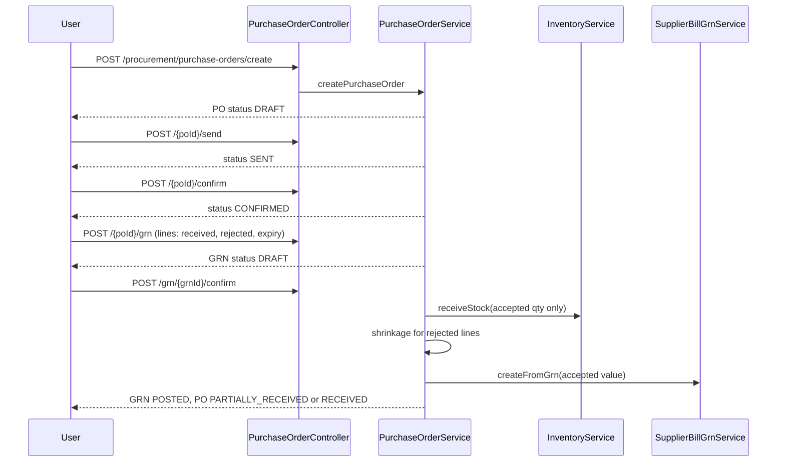
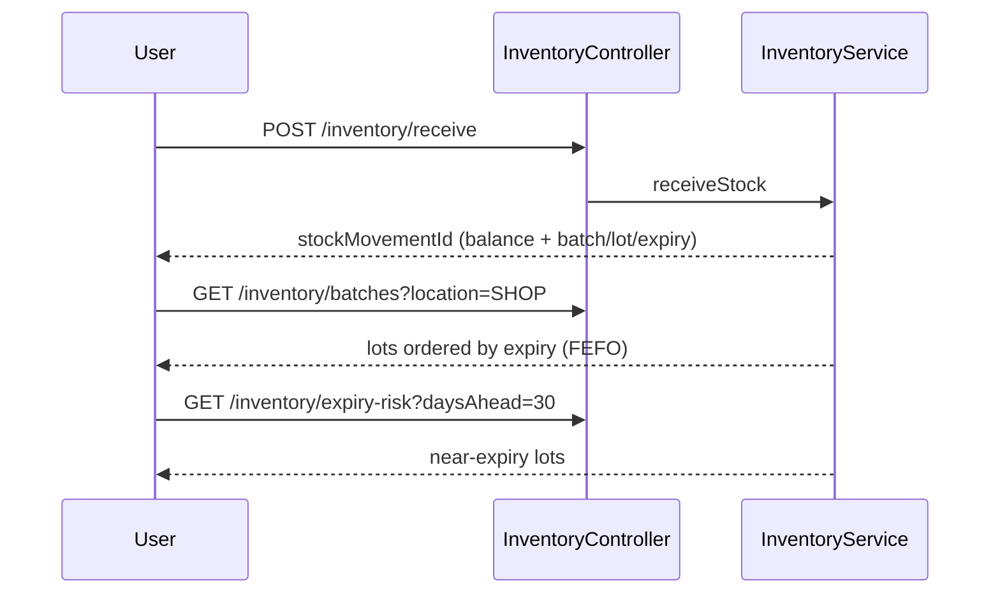
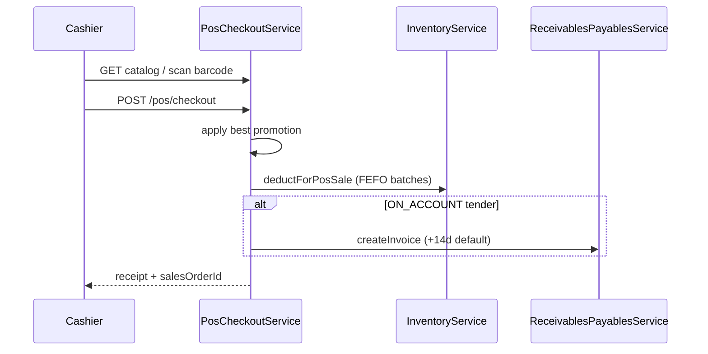
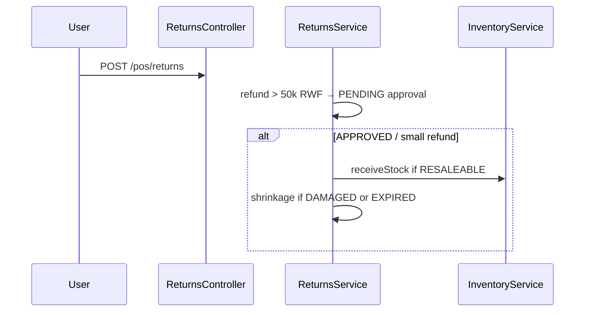
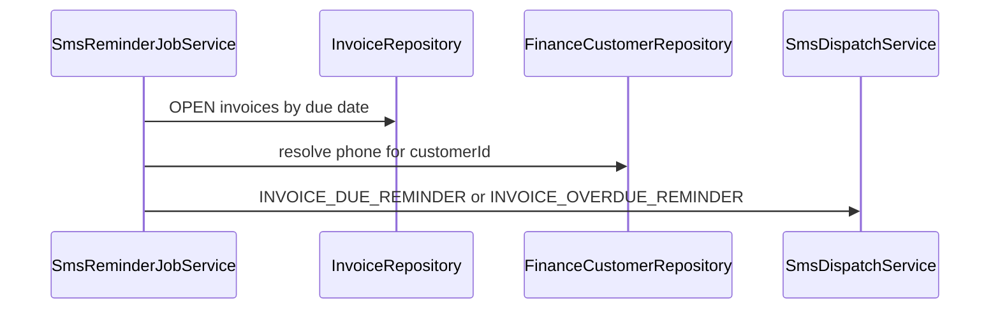

# Retail: buy → store → sell (API sequence reference)

Team reference for procurement, inventory, POS, returns, and AR reminders.  
Base path: `/api/v1`. All routes require JWT + `X-Tenant-Id`.

---

## 1. Purchase order → goods receipt → supplier bill

| Step | Endpoint | Notes |
|------|----------|--------|
| Create PO | `POST /procurement/purchase-orders/create` | Lines: productId, ordered qty, unit cost |
| Auto PO | `POST /procurement/purchase-orders/from-low-stock/{productId}` | Preferred supplier + suggested qty |
| Send | `POST /procurement/purchase-orders/{poId}/send` | Body: `{ "sentVia": "EMAIL" }` |
| Confirm | `POST /procurement/purchase-orders/{poId}/confirm` | Supplier acknowledged |
| Draft GRN | `POST /procurement/purchase-orders/{poId}/grn` | `rejectedQuantity`, `allowExpiredReceipt` |
| Post GRN | `POST /procurement/purchase-orders/grn/{grnId}/confirm` | Stock + AP bill = **accepted** qty only |
| 3-way match | `GET /procurement/purchase-orders/{poId}/three-way-match/{billId}` | PO vs GRN vs bill |

**Accepted quantity** = `receivedQuantity - rejectedQuantity`.  
**Supplier bill** = sum(accepted × unitCost). Rejected stock is written off via shrinkage, not stocked.

**Expiry:** If `expiryDate` is before today, confirm fails unless `allowExpiredReceipt: true` on the GRN request.

---

## 2. Inventory (store)

| Endpoint | Purpose |
|----------|---------|
| `GET /inventory/balances` | On-hand by product/location |
| `GET /inventory/batches` | Lot codes, expiry, qty |
| `GET /inventory/low-stock` | Below reorder point |
| `GET /inventory/expiry-risk` | Expiring within N days |
| `POST /inventory/receive` | Ad-hoc receipt (requires `costPrice`) |
| `POST /inventory/move` | Transfer between locations |

---

## 3. POS checkout → stock (FEFO) → AR

| Tender | Behavior |
|--------|----------|
| CASH / CARD | `reconciliationStatus` NA |
| MOMO / AIRTEL_MONEY | PENDING until reconciled |
| ON_ACCOUNT | Creates OPEN invoice; credit limit check |

Stock deduction uses **earliest expiry first**; sale lines store `inventoryBatchId` and `costPrice`.

---

## 4. Returns

---

## 5. Invoice SMS reminders (including overdue)

| Stage | When (short term &lt; 60d) | When (long term ≥ 60d) |
|-------|---------------------------|-------------------------|
| advance | — | 30 days before due |
| week-before | 7 days before | 7 days before |
| due-today | Due date | Due date |
| overdue-1 | 1 day after due | 1 day after due |
| overdue-7 | 7 days after | 7 days after |
| overdue-14 | 14 days after | 14 days after |
| overdue-30 | 30 days after | 30 days after |

Run: `POST /api/v1/admin/jobs/sms-reminder/run` (optional `simulateDate`).

Customer **phone** is read from `finance_customers.phone` (E.164, e.g. `+250788123456`).

---

## Related modules (not installment schedules)

Credit sales today: **one invoice per ON_ACCOUNT tender**, not multi-installment plans.  
Installment schedules remain a future enhancement (Option B3).
